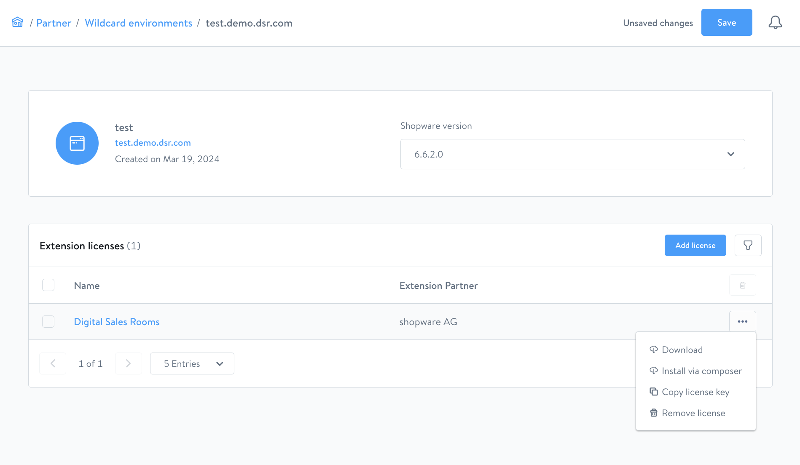

---
nav:
   title: Admin side installation
   position: 20

---

# Admin Side Installation

::: info
Digital Sales Rooms plugin is a licensed plugin. If you alredy know how to install a licensed plugin, you can skip this part.
:::

::: warning
As part of the Shopware Beyond plan, the Digital Sales Rooms is available to you as an extension.
Same with other plugins, you have multiple ways to fetch the plugin via composer, via download, via Shopware Account.
Digital Sales Rooms plugin is a licensed plugin. If you alredy know how to install a licensed plugin, you can skip this part.
:::


In this part, we will learn how to get & install the Digital Sales Rooms plugin into local Shopware instance.

## Get the plugin

If you are a merchant with Shopware Beyond, you can access to account.shopware.com and create a wildcard environment with attached plugins. Please read [guideline](https://docs.shopware.com/en/account-en/extension-partner/wildcard-environments).


By this way, you can get the plugin fastly into Shopware instance via multiple ways (via composer, via download or via Shopware Account).

### via download
To install a plugin via download, follow these steps:

- From wildcard environment detail page, click on the plugin and then click on the “Download” button.
- Save the zip file to your computer.
- In your Shopware 6 instance source code, go to the `custom/plugins` directory.
- Extract the zip file into the `custom/plugins` directory with name `SwagDigitalSalesRooms`.

### via composer
To install a plugin via composer, follow these steps:

- From wildcard environment detail page, click on the plugin and then click on the "Install via composer" button.
- A modal will appear and contain all command lines to install.

## Activate the plugin in Admin Extension

Once you fetched the plugin, you can run the below Symfony commands for activate plugin:

```bash
# refresh the list of available plugins
bin/console plugin:refresh
# find the plugin **name** (first column on the list). In this case, it is "**SwagDigitalSalesRooms"**
bin/console plugin:install **SwagDigitalSalesRooms** --activate
# clear the cache afterward
bin/console cache:clear

# Now it is ready to use
```
